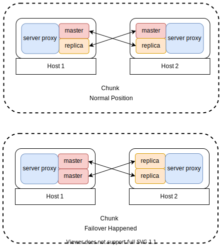

# Set Up Cluster By Hand
This tutorial will walk you through the process to set up an `undermoon` cluster by hand
to better understand how `undermoon` works.

## Architecture
We will deploy all the following parts in one machine:
- mem_broker
- coordinator
- two proxies with four nodes.


## Build the Binaries
```bash
$ cargo build
```
Note that you also need to install Redis.

## Deploy Memory Broker
```bash
$ RUST_LOG=undermoon=debug,mem_broker=debug UNDERMOON_ADDRESS=127.0.0.1:7799 target/debug/mem_broker
```

## Deploy Coordinator
Run the coordinator and specify the memory broker address.
```bash
$ RUST_LOG=undermoon=debug,coordinator=debug UNDERMOON_BROKER_ADDRESS=127.0.0.1:7799 target/debug/coordinator
```

## Deploy Server Proxy and Redis

#### Chunk
Refers to the [chunk docs](./chunk.md) for detailed explanation.


#### Run Server Proxy and Redis
Run 2 server proxies and 4 Redis nodes:
```bash
# You need to run each line in different terminals

# The first half
$ redis-server --port 7001
$ redis-server --port 7002
$ RUST_LOG=undermoon=debug,server_proxy=debug UNDERMOON_ADDRESS=127.0.0.1:6001 target/debug/server_proxy

# The second Half
$ redis-server --port 7003
$ redis-server --port 7004
$ RUST_LOG=undermoon=debug,server_proxy=debug UNDERMOON_ADDRESS=127.0.0.1:6002 target/debug/server_proxy
```

## Register Server Proxy and Redis to Memory Broker
A Redis cluster could never be created in a single machine.
Memory broker won't be able to create a cluster even we have enough nodes
because all of them seems to in the same host `127.0.0.1`;

But since we are deploying the whole `undermoon` cluster in one machine,
we need to explicitly tell the memory broker they are in different hosts
by specifying the `host` field to `localhost1` and `localhost2` in the posted json.
```bash
curl -XPOST -H 'Content-Type: application/json' "http://localhost:7799/api/v2/proxies/meta" -d '{"proxy_address": "127.0.0.1:6001", "nodes": ["127.0.0.1:7001", "127.0.0.1:7002"], "host": "localhost1"}'
curl -XPOST -H 'Content-Type: application/json' "http://localhost:7799/api/v2/proxies/meta" -d '{"proxy_address": "127.0.0.1:6002", "nodes": ["127.0.0.1:7003", "127.0.0.1:7004"], "host": "localhost2"}'
```

Now we have 2 free server proxies with 4 nodes.
```bash
$ curl http://localhost:7799/api/v2/proxies/addresses
{"addresses":["127.0.0.1:6001","127.0.0.1:6002"]}

$ curl http://localhost:7799/api/v2/proxies/meta/127.0.0.1:6001
{"proxy":{"address":"127.0.0.1:6001","epoch":2,"nodes":[],"free_nodes":["127.0.0.1:7001","127.0.0.1:7002"],"peers":[],"clusters_config":{}}}

$ curl http://localhost:7799/api/v2/proxies/meta/127.0.0.1:6002
{"proxy":{"address":"127.0.0.1:6002","epoch":2,"nodes":[],"free_nodes":["127.0.0.1:7003","127.0.0.1:7004"],"peers":[],"clusters_config":{}}}
```

## Create Cluster
Create a cluster named `mycluster` with 4 Redis nodes.
```bash
$ curl -XPOST -H 'Content-Type: application/json' http://localhost:7799/api/v2/clusters/meta/mycluster -d '{"node_number": 4}'
```

Now we can connect to the cluster:
```bash
$ redis-cli -h 127.0.0.1 -p 6001 -c
127.0.0.1:6001> cluster nodes
mycluster___________2261c530e98070a6____ 127.0.0.1:6001 myself,master - 0 0 3 connected 8192-16383
mycluster___________ad095468b9deeb2d____ 127.0.0.1:6002 master - 0 0 3 connected 0-8191
127.0.0.1:6001> get a
(nil)
127.0.0.1:6001> get b
-> Redirected to slot [3300] located at 127.0.0.1:6002
"1"
```
